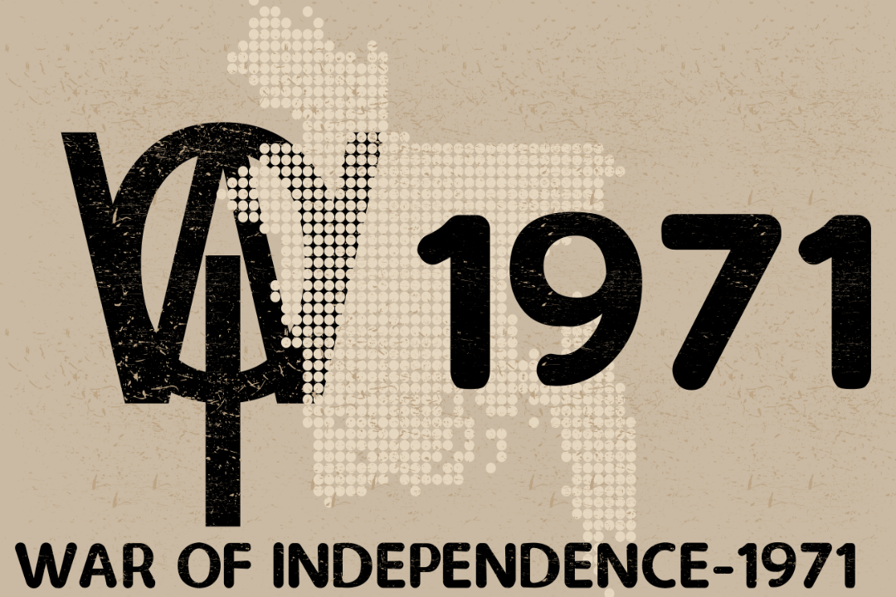

# **War Of Independence-1971**(WOI-1971)


##  **Introduction**
**War Of Independence-1971** (WOI-1971) is an SDL-based action game written in C language. Simple, clear, and easily customizable code made this game distinctive. Based on the Bangladeshi people's war of independence against Pakistani military forces in 1971. The bravery of the Bangladeshi Freedom Fighters is honored with great reverence in this game. 

## **Installation**
1. **Downloading the Game Resources:** 
    Download directly on your linux device (Ubuntu based or similiar) as zip or using "git clone" 
        https://github.com/AbdullahArean/WOI-1971
2. **Installing in the Device:**
 Go to **"WOI-1971"** Folder (Newly Cloned or downloaded) through Terminal and run the following command
```bash
        ./install.sh
```

3. **Play and enjoy the game**
  Give The Following command  
  ```bash
      ./WOI-1971 
  ```
  or,
```bash
    make play
```

  ### Direct installation and Play 
  1. **Download:** You can directly download the following script and run it in our device (Debian-based).No Prerequisite Needed.
  https://drive.google.com/uc?export=download&id=1i8SkAuo6q7Sa-TxaRrtHTkzQQLEEKnMv 

  2. **Install & Run:** Go to Download Folder and Open Terminal and Type The Following:
  ```bash
    chmod +x gameinstall.sh && ./gameinstall.sh
  ```
## **Story**
The story behind the game is about the War of Independence of Bangladesh in 1971. The Hindu-Muslim communal tensions fanned by the British colonial rulers to perpetuate their hold on India had led to the partition of India in 1947. Pakistan was created as a separate homeland for Muslims. The Province of East Pakistan was physically separated from West Pakistan by a thousand miles. Pakistan, therefore, was an unrealistic state from the very beginning. The Pakistani ruling elite controlled by the military elite subjugated the Bengalis politically, culturally and economically and therefore the disillusionment with the new nation was not surprising. In the first-ever national Parliamentary elections held in 1970 based on a one-man-one-vote basis, the Bengali nationalist forces led by Bangabandhu Sheikh Mujibur Rahman won a landslide victory and his party, the Awami League became the majority party in the whole of Pakistan. However, in an attempt to crush this nationalistic movement, the Pakistani Military Junta unleashed a systematic genocide against the Bengali people on the fateful night of March 25, 1971. The Junta received support only from a handful of religion-based local parties and religious fundamentalists.
Then the war began.
The Hero of this game is a freedom fighter named “Aresan” whose objective is to free Bangladesh from the Pakistani Military Junta. Gamers will try to kill all of them while not hurting any innocent Bengali. The enemies will also fire and if the bullet touches the hero, the health will decrease. If a Gamer kills a certain number of Military (earns a certain number of points), he will conquer that place and the next battle place will be unlocked. In this game, the battle place would be many historical places of Bangladesh. So the main objective of the gamer in a word is “Freeing the Bengalis” as well as “Freeing Bangladesh”.
## Objectives
 1. Making an simple yet interesting action game on Bangladesh War of Independence 1971, tributinng the freedom fighters
  2. Attractive graphics and animation along with interactive sound
  3. Well organized and documented code to easily understand and further development

## Project Features

  1. **Simple, clear and easily customizable code** in a structured and modulerized manner with proper commenting.
  2. Easy installation in **Debian-Based** Computers and one-click installation process **Direct Install and Play** (bash script will download everything required)
  3. One Command Game **update & ugrade** to latest release feature
  4. Attractive and **dynamic** menu options to control the game
  5. **Crispy Sound System** Specifications and sound on/off feature
  6. Simple yet interesting **game logic** and 100% control 
  7. **Multiple enemy** types and different enemy attacks (Paddle Enemy, Tank etc.)
  8. Powerful hero and its **simultaneous** health and game-score update and display
  9. Displaying **Highscore** and saving Score with player name, bullet spent, player health
  10. Memory efficient design and **Same performance** in every device (if possible to play) 
  11. Online presence of code with powerful **GitHub Repository** with informative [Readme.md](https://github.com/AbdullahArean/WOI-1971#readme). Clean GitHub **Workflow** with best practices of git.

## **Project Files & Modules**
1. **main.cpp**
2. **bullet.h**
3. **clean.h**
4. **constants.h**
5. **game.h**
6. **gameplay.h**
7. **player.h**
8. **enemy.h**
9. **tank.h**
10. **innocent.h**
11. **texturemanager.h**
12. **sound.h**
13. **font.h**
14. **initialization.h**
15. **mainmenu.h**
16. **settings.h**
17. **pause.h**
18. **lastpage.h**
19. **scoring.h**

## **Credit**
1. **Abdullah Ibne Hanif Arean** [*Linkedin Profile*](https://www.linkedin.com/in/abdullaharean/)
        Roll No: FH-12 (Reg. No: 2019-917-795), **Team Leader** 
2. **Mehadi Hasan**
        Roll No: SH-60(Reg. No: 2019-517-843), **Team Member**
        

## **Platform, Library & Tools**
- [C/C++](https://en.wikipedia.org/wiki/C%2B%2B) - Basic coding of the game done in c!
- [VS Code](https://code.visualstudio.com/) -  Free. Built on open source yet powerful IDE!
- [ SDL2 ](https://www.libsdl.org) - cross-platform development library designed to provide low level access!
- [ Inkscape](https://inkscape.org/) - professional quality vector graphics software and open source!
- [Git/GitHub](https://github.com/) - software development and version control using Git!
- [Bash](https://www.gnu.org/software/bash/)- Unix shell and command language
- [Markdown](https://en.wikipedia.org/wiki/Markdown) -  lightweight markup language for creating formatted text!

## **Limitations**
1. Movement of the characters donot have attractive animation, graphics is yet to be developed
2. Though game level is easy to create in this customizable game, not implemented that much till now.
3. Written in C,in structured manner, no object oriented code written or used.

## **Future plan**
The War of Independence is a great event in the national history of Bangladesh. There are a few games developed on this event though 50 years passed of our independence. It is high time we made a stunning game on this event and made the world aware of the heroism of the Bangladeshi people in 1971. The game will be developed in a 2D SDL2/C++ initially for the project, but we have aspirations to make it across all platforms(Android, IOS, Windows) 3D game using the power of Unreal Engine, Unity, Autodesk, Blender etc. later on.

## **Github Repository**

        https://github.com/AbdullahA971rean/WOI-1971

## **References**
### SDL Learning Sources:
        https://lazyfoo.net/tutorials/SDL/
        https://www.packtpub.com/product/sdl-game-development/
        https://www.parallelrealities.co.uk/
### Free Image Source: 
        https://www.freepik.com/

## **License**
**Free Software, Hell Yeah!**
## **Conclusions**
Apart from learning new language and technology,this game-project taught us collaboration, pressure handling, peer communication and many other important qualities a software enginner should have. I hope we could implement these learning in our life in future. 


