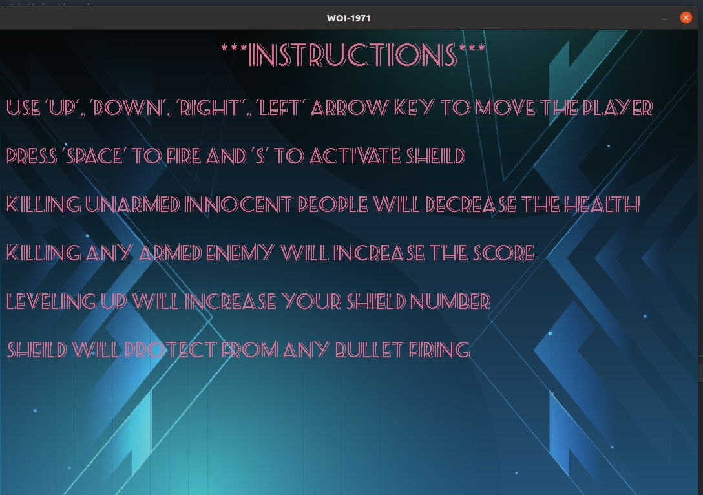

# **War Of Independence-1971**(WOI-1971)


##  **Introduction**
**War Of Independence-1971** (WOI-1971) is an SDL-based action game written in C language. Simple, clear, and easily customizable code made this game distinctive. Based on the Bangladeshi people's war of independence against Pakistani military forces in 1971. The bravery of the Bangladeshi Freedom Fighters is honored with great reverence in this game. 

## **Installation**
1. **Downloading the Game Resources:** 
    Download directly on your linux device (Ubuntu based or similiar) as zip or using "git clone" 
        https://github.com/AbdullahArean/WOI-1971
2. **Installing in the Device:**
 Go to **"WOI-1971"** Folder (Newly Cloned or downloaded) through Terminal and run the following command
```bash
        ./install.sh
```

3. **Play and enjoy the game**
  Give The Following command  
  ```bash
      ./WOI-1971 
  ```
  or,
```bash
    make play
```

  ### Direct installation and Play 
  1. **Download:** You can directly download the following script and run it in our device (Debian-based).No Prerequisite Needed.
  https://drive.google.com/uc?export=download&id=1i8SkAuo6q7Sa-TxaRrtHTkzQQLEEKnMv 

  2. **Install & Run:** Go to Download Folder and Open Terminal and Type The Following:
  ```bash
    chmod +x gameinstall.sh && ./gameinstall.sh
  ```
## **Story**
The story behind the game is about the War of Independence of Bangladesh in 1971. The Hindu-Muslim communal tensions fanned by the British colonial rulers to perpetuate their hold on India had led to the partition of India in 1947. Pakistan was created as a separate homeland for Muslims. The Province of East Pakistan was physically separated from West Pakistan by a thousand miles. Pakistan, therefore, was an unrealistic state from the very beginning. The Pakistani ruling elite controlled by the military elite subjugated the Bengalis politically, culturally and economically and therefore the disillusionment with the new nation was not surprising. In the first-ever national Parliamentary elections held in 1970 based on a one-man-one-vote basis, the Bengali nationalist forces led by Bangabandhu Sheikh Mujibur Rahman won a landslide victory and his party, the Awami League became the majority party in the whole of Pakistan. However, in an attempt to crush this nationalistic movement, the Pakistani Military Junta unleashed a systematic genocide against the Bengali people on the fateful night of March 25, 1971. The Junta received support only from a handful of religion-based local parties and religious fundamentalists.
Then the war began.
The Hero of this game is a freedom fighter named “Aresan” whose objective is to free Bangladesh from the Pakistani Military Junta. Gamers will try to kill all of them while not hurting any innocent Bengali. The enemies will also fire and if the bullet touches the hero, the health will decrease. If a Gamer kills a certain number of Military (earns a certain number of points), he will conquer that place and the next battle place will be unlocked. In this game, the battle place would be many historical places of Bangladesh. So the main objective of the gamer in a word is “Freeing the Bengalis” as well as “Freeing Bangladesh”.
## Objectives
 1. Making an simple yet interesting action game on Bangladesh War of Independence 1971, tributinng the freedom fighters
  2. Attractive graphics and animation along with interactive sound
  3. Well organized and documented code to easily understand and further development

## Project Features

  1. Simple, clear and easily customizable code in a structured and modularized manner with proper commenting.
  2. Easy installation in Debian-Based Computers and one-click installation process Direct Install and Play (bash script will download everything required)
  3. Memory efficient design and Same performance in every device (if possible to play)
  4. One Command Game update & upgrade to the latest release feature with “./update.h command”
  5. A Loading page with the game logo (Custom Created)
  
  6. Attractive and dynamic menu options to control the game
  
  7. Showing Instructions on the created window
  
  8. Challenging Levels with Multiple Enemy Types
  
  9. Here are Innocent People too. If the hero kills them, he will get a penalty. And There is also an interesting feature, that players have shields, which will protect it from firing damage.
 
  10. Crispy Sound System Specifications and sound on/off feature
  
  11. There is also a Story page where we can see and learn about some stories related to our independence war.
  
  12. Simple yet interesting game logic and 100% control
  13. Powerful hero and its simultaneous health and game-score update and display
  14. Displaying High Score on the created window
  
  15. A last page is designed to get Usernames(i.e. who is playing) by clicking the “Save Score” option
  

  16.Online presence of code with powerful GitHub Repository with informative Readme.md. Clean GitHub Workflow with best practices of git.


## **Project Files & Modules**
1. **main.cpp** : Calling a struct Game variable and using its functions init(), running(), handleEvents(), update(), and render() in the main() function for initializing, running loop, handling the events, updating the game and game objects and rendering the objects respectively. Moreover, we are quitting the game by calling the destroy_window() function from the ‘Game’ structure.
2. **bullet.h** :A structure for bullets of the player with two functions “Bulletfire” and “update”. Bullet first time rendered in Bulletfire function. In the update function, bullet position changes, and all the enemies, tanks and innocent is checked if hit by the bullet or not. After that update of player health, score, enemy health executed accordingly.
3. **ebullet.h** :A structure for bullets of the enemy (enemy & tank) with two functions “Bulletfire” and “update”. Bullet first time rendered in Bulletfire function. In the update function, bullet position changes, and the player is checked if hit by the  bulet or not. After that update of player health, the score executed accordingly.
4. **clean.h** :Destroying window and renderer by using the function Clean() and quitting all the subsystems such as video, audio, image, font.
5. **constants.h** :All the constants and SDL-related directory is linked there, and building c preprocessors. For this reason, these include does not need to do in the rest of the files, we used constants.h .
6. **game.h** :This file contains game structure with four major functions, initialization, handle events, update, render where many header files are included and many functions are called. checker function if game is running is to easily access the game state.
7. **gameplay.h** :Here “gameplay.h” is the main header file with multiple functions, that truly makes the gameplay. All the necessary files are included here and called here. Player, enemy, tank, innocent is called here according to game logic. Level-wise distribution of work will be found here.
8. **player.h** :Player structure denoting the main character of the game, render, draw and update the player. There is also shield maintenance. If the shield is on it is displayed. Player movement can be done along all the direction. Flexible player position input and render made the game more interesting. There is also a function to return the position of the Player.
9. **enemy.h** :A structure is made for rendering and loading the enemy as well as keep track of its position and velocity. 
10. **tank.h** :In this section, the tank is being rendered and loaded. Moreover, Kept the tracking of the tank’s current position along with its velocity. 
11. **innocent.h** :These three structures are the same type of function with slight differences, quite similar to player.h, they have their own function to init, render, handle events and update themselves. it can return its position and update its health accordingly. This function enables us to access its private variable can be accessed from any file easily
12. **texturemanager.h** :Loading textures and rendering them in this section made easy by this header file. One line code now can do a lot of works.
13. **sound.h** :Some sound-related variables and some built-in functions related to the sound/audio system have been used to control the sound system.
14. **mainmenu.h** :There are Continue, New Game, Highest Score, Settings and Story options in the main menu which are rendered and updated there.
15. **last page.h** :The header is used to render and update the Replay, Next Level, Save Score and Exit buttons in the last page.
16. **highscore.h** :The code for showing the top 5 scores has been implemented in this section by calling high() function.
17. **pause.h** :Rendering and updating the Continue, Exit and Main Menu options. 
18. **settings.h** :Controlling the sound system by using logic and can go back to the main menu.
19. **instruction.h** :This header has been implemented to show the instructions and congratulations messages on the created window. 
20. **font.h** : A FontManager structure is created to load the font and display them on the created window by using two different functions.
21. **initialization.h** :Initialized all the subsystems used in the whole game(i.e. audio, image, font etc).
22. **install.sh** :Simple bash scripting file to install of the game along with the dependencies . SDL2 Library and Github will be installed if not in the Linux device and Will Clone the remote github repository, then build the project making an executable “WOI-1971” file.    
23. **update.sh** :Simple bash scripting file to install the latest update of the game project. The github repository is the main source now. the file will discard all the changes user made to the code and will pullall the latest changes developer made in the main github repository.


## **Team Member Responsibilities**
1. **Abdullah Ibne Hanif Arean** [*Linkedin Profile*](https://www.linkedin.com/in/abdullaharean/)
        Roll No: FH-12 (Reg. No: 2019-917-795), **Team Leader** 
    1. Graphics Designing  (Inkscape, Photoshop, Blender)
    2. Version Control (Git/GitHub)
    3. Logic design and implementation
    4. Structured Game Source Code Writing in C
    5. Page Showing Code, Dynamic Menu, Character Coding
    6. Game Deployment & update

2. **Mehadi Hasan**
        Roll No: SH-60(Reg. No: 2019-517-843), **Team Member**
    1.  Logic Design
    2. Structured Game Source Code Writing in C
    3. Font, File Handling, Sound, Instruction Coding
    4. Code Testing and Bug Fixing    
        
        

## **Platform, Library & Tools**
- [C/C++](https://en.wikipedia.org/wiki/C%2B%2B) - Basic coding of the game done in c!
- [VS Code](https://code.visualstudio.com/) -  Free. Built on open source yet powerful IDE!
- [ SDL2 ](https://www.libsdl.org) - cross-platform development library designed to provide low level access!
- [ Inkscape](https://inkscape.org/) - professional quality vector graphics software and open source!
- [Git/GitHub](https://github.com/) - software development and version control using Git!
- [Bash](https://www.gnu.org/software/bash/)- Unix shell and command language
- [Markdown](https://en.wikipedia.org/wiki/Markdown) -  lightweight markup language for creating formatted text!

## **Limitations**
1. Movement of the characters donot have attractive animation, graphics is yet to be developed
2. As it is written in C only, no upgraded feature of c++ is  available
3. Written in C,in structured manner, no object oriented code written or used.
4. Replay of the game still to develop


## **Future plan**
The War of Independence is a great event in the national history of Bangladesh. There are a few games developed on this event though 50 years passed of our independence. It is high time we made a stunning game on this event and made the world aware of the heroism of the Bangladeshi people in 1971. The game will be developed in a 2D SDL2/C++ initially for the project, but we have aspirations to make it across all platforms(Android, IOS, Windows) 3D game using the power of Unreal Engine, Unity, Autodesk, Blender etc. later on.

## **Github Repository**
https://github.com/AbdullahA971rean/WOI-1971

## **Sourceforge.net Project Link**
https://sourceforge.net/projects/woi-1971/

## **Official Facebook Page**
https://www.facebook.com/War-Of-Independence-1971-104790995115376


## **YouTube Intro Video Link**
[](https://www.youtube.com/watch?v=1e38v-MTL8w)

## **References**
### SDL Learning Sources:
https://lazyfoo.net/tutorials/SDL/
https://www.packtpub.com/product/sdl-game-development/
https://www.parallelrealities.co.uk/
### Free Image Source: 
https://www.freepik.com/

## **License**
**Free Software, Hell Yeah!**
## **Conclusions**
Apart from learning new language and technology,this game-project taught us collaboration, pressure handling, peer communication and many other important qualities a software enginner should have. I hope we could implement these learning in our life in future. 


